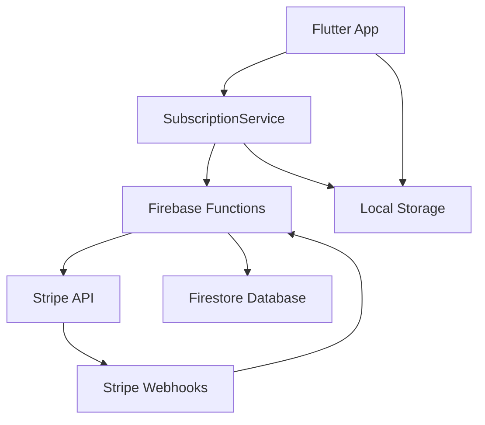
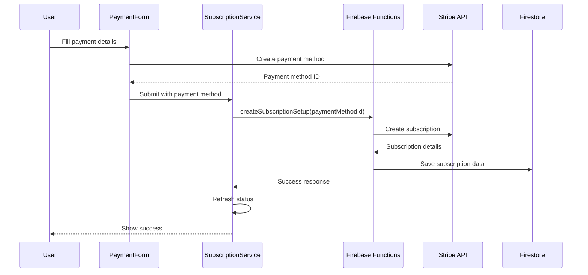
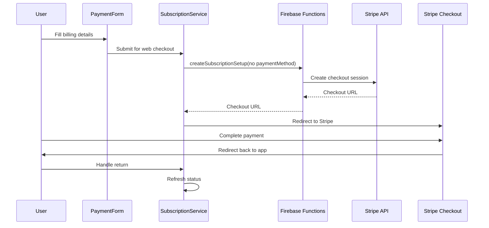

# Stripe Integration System Documentation

## Overview

This system implements a comprehensive Stripe integration for a Flutter application (Theorie) with support for both mobile and web platforms. It handles subscriptions, payments, and provides a seamless cross-platform experience with different payment flows optimized for each platform.

## Architecture



### Core Components

#### Frontend (Flutter)
- **SubscriptionService** - Main service handling all subscription operations
- **PaymentFormWidget** - Platform-aware payment form
- **SubscriptionManagementPage** - UI for managing subscriptions
- **SubscriptionStarWidget** - Status indicator widget
- **Data Models** - Type-safe models for subscriptions and payments

#### Backend (Firebase Functions)
- **HTTP Endpoints** - RESTful API for subscription operations
- **Webhook Handler** - Processes Stripe webhook events
- **Database Integration** - Syncs data with Firestore

## Platform-Specific Flows

### Mobile Flow (iOS/Android)



**Key Features:**
- Uses Stripe's native mobile SDKs
- Direct payment method creation in-app
- Immediate subscription creation
- Real-time status updates

### Web Flow (Browser)



**Key Features:**
- Redirects to Stripe's hosted checkout
- Handles return URLs and session validation
- Secure payment processing outside the app
- Automatic tax calculation and compliance

## Component Details

### SubscriptionService (`subscription_service.dart`)

The central service managing all subscription operations.

**Key Methods:**
- `initialize()` - Sets up the service and loads cached data
- `startSubscriptionWithPaymentMethod()` - Handles both mobile and web flows
- `refreshSubscriptionStatus()` - Syncs with backend
- `cancelSubscription()` / `pauseSubscription()` / `resumeSubscription()` - Subscription management
- `testAuthentication()` / `testBasicConnectivity()` - Debugging utilities

**Features:**
- **Offline Support** - Caches subscription data locally using SharedPreferences
- **Automatic Sync** - Periodic background synchronization with Firebase
- **Error Handling** - Comprehensive error handling with user-friendly messages
- **Debug Mode** - Built-in testing and debugging capabilities

### PaymentFormWidget (`payment_form_widget.dart`)

Platform-adaptive payment form with intelligent flow detection.

**Platform Detection:**
```dart
bool get _isWeb => kIsWeb;
bool get _canUseCardField => !_isWeb;
```

**Mobile Implementation:**
- Uses `CardField` from flutter_stripe
- Real-time card validation
- Direct payment method creation

**Web Implementation:**
- Shows informational UI about redirect
- Collects billing information
- Triggers Stripe Checkout flow

### Firebase Functions (`index.ts`)

Backend API handling Stripe integration and webhook processing.

**Main Endpoints:**

#### `createSubscriptionSetup`
Handles subscription creation with platform-specific logic:

```typescript
// Mobile flow - with payment method
if (paymentMethodId) {
  await handleMobileSubscriptionFlow(stripe, customer, priceId, tier, userId, paymentMethodId, res);
} else {
  // Web flow - Stripe Checkout
  await handleWebCheckoutFlow(stripe, customer, priceId, tier, userId, email, res);
}
```

#### `getSubscriptionStatus`
Returns current subscription status:
- Fetches from Stripe API
- Formats for app consumption
- Handles authentication and errors

#### `stripeWebhook`
Processes Stripe webhook events:
- Verifies webhook signatures
- Updates Firestore with subscription changes
- Handles various subscription lifecycle events

**Supported Webhook Events:**
- `customer.subscription.created`
- `customer.subscription.updated`
- `customer.subscription.deleted`
- `invoice.payment_succeeded`
- `invoice.payment_failed`
- And more...

## Data Models

### SubscriptionData (`subscription_models.dart`)

```dart
class SubscriptionData {
  final SubscriptionStatus status;
  final SubscriptionTier tier;
  final String? subscriptionId;
  final DateTime? currentPeriodEnd;
  // ... other fields
}
```

**Key Features:**
- Null-safe design
- JSON serialization support
- Helper methods for access checks
- Immutable with `copyWith` support

### SubscriptionPaymentData (`payment_models.dart`)

Wraps Stripe's payment data to avoid naming conflicts:

```dart
class SubscriptionPaymentData {
  final String paymentMethodId;
  final BillingDetails billingDetails;
}
```

## Security & Authentication

### Authentication Flow
1. User signs in with Firebase Auth
2. ID token is automatically attached to requests
3. Firebase Functions verify tokens using `verifyIdToken()`
4. User context is provided to all operations

### Security Features
- **Token Verification** - All sensitive operations require valid Firebase ID tokens
- **CORS Configuration** - Properly configured for web app domains
- **Webhook Verification** - Stripe webhook signatures are verified
- **Customer Isolation** - Users can only access their own subscription data

## Error Handling

### Client-Side Error Handling
```dart
try {
  await service.startSubscriptionWithPaymentMethod(tier: tier, paymentMethodId: paymentId);
} on StripeException catch (e) {
  // Handle Stripe-specific errors
} catch (e) {
  // Handle general errors
}
```

### Server-Side Error Handling
- Detailed logging for debugging
- User-friendly error messages
- Graceful degradation for network issues
- Retry logic for transient failures

## Configuration

### Environment Variables
```typescript
// Firebase Functions
const priceIds = {
  premium: process.env.STRIPE_PREMIUM_PRICE_ID || "price_1RsKbaILJ0OoLUiBITKrhYdn",
  premiumAnnual: process.env.STRIPE_PREMIUM_ANNUAL_PRICE_ID || "price_1RsKbbILJ0OoLUiBDlSe2quB",
};
```

### Required Secrets
- `STRIPE_SECRET_KEY` - Stripe API secret key
- `STRIPE_WEBHOOK_SECRET` - Webhook endpoint secret

## Debugging & Testing

### Debug Panel
The subscription management page includes a comprehensive debug panel:

- **Basic Connectivity** - Tests HTTP connection to Firebase Functions
- **Authentication** - Verifies Firebase Auth token
- **Subscription Status** - Tests subscription data retrieval
- **Refresh Status** - Forces sync with backend
- **Clear Local Data** - Resets cached subscription data

### Logging
Comprehensive logging throughout the system:
- Client-side: Uses `debugPrint()` with categorized messages
- Server-side: Structured logging with emojis for easy identification

```dart
debugPrint('🔄 [SubscriptionService] Starting subscription...');
debugPrint('✅ [SubscriptionService] Subscription created successfully');
debugPrint('❌ [SubscriptionService] Error: ${error.toString()}');
```

## Deployment Checklist

### Frontend Configuration
- [ ] Configure Stripe publishable keys
- [ ] Set up Firebase project configuration
- [ ] Configure return URLs for web checkout
- [ ] Test on both mobile and web platforms

### Backend Configuration
- [ ] Deploy Firebase Functions
- [ ] Set Stripe secret key in Firebase secrets
- [ ] Configure webhook endpoints in Stripe Dashboard
- [ ] Set up environment variables for price IDs
- [ ] Configure CORS origins for production domains

### Stripe Configuration
- [ ] Create products and price IDs
- [ ] Set up webhook endpoints
- [ ] Configure tax settings (if using automatic tax)
- [ ] Test webhook delivery

## Best Practices

### Performance
- **Caching** - Local storage prevents unnecessary API calls
- **Lazy Loading** - Service initializes only when needed
- **Background Sync** - Periodic updates don't block UI

### User Experience
- **Platform Optimization** - Different flows for mobile vs web
- **Error Recovery** - Clear error messages with retry options
- **Offline Support** - App remains functional without network
- **Loading States** - Proper loading indicators during operations

### Maintenance
- **Monitoring** - Comprehensive logging for issue diagnosis
- **Testing** - Built-in debug tools for validation
- **Documentation** - Code is well-documented with examples
- **Error Tracking** - Structured error handling for easy debugging

## Troubleshooting

### Common Issues

**"Payment method creation failed"**
- Check Stripe publishable key configuration
- Verify card details are valid
- Ensure network connectivity

**"Authentication required"**
- User needs to sign in with Firebase Auth
- Check ID token validity
- Verify Firebase configuration

**"Subscription setup failed"**
- Check Firebase Functions deployment
- Verify Stripe secret key configuration
- Check webhook endpoint configuration

**Web checkout not working**
- Verify return URLs are configured
- Check CORS configuration
- Ensure checkout session creation succeeds

### Debug Steps
1. Enable debug panel in subscription management
2. Run connectivity tests
3. Check authentication status
4. Review Firebase Functions logs
5. Verify Stripe webhook delivery
6. Check Firestore data consistency

## Future Enhancements

### Potential Improvements
- **Proration Handling** - Support for mid-cycle plan changes
- **Multiple Payment Methods** - Allow users to save multiple cards
- **Dunning Management** - Advanced failed payment handling
- **Analytics Integration** - Track subscription metrics and churn
- **Internationalization** - Support for multiple currencies and locales
- **Apple Pay/Google Pay** - Native payment method support

### Scalability Considerations
- **Caching Layer** - Redis for frequently accessed data
- **Rate Limiting** - Protect against abuse
- **Load Balancing** - Distribute webhook processing
- **Database Optimization** - Efficient queries and indexing